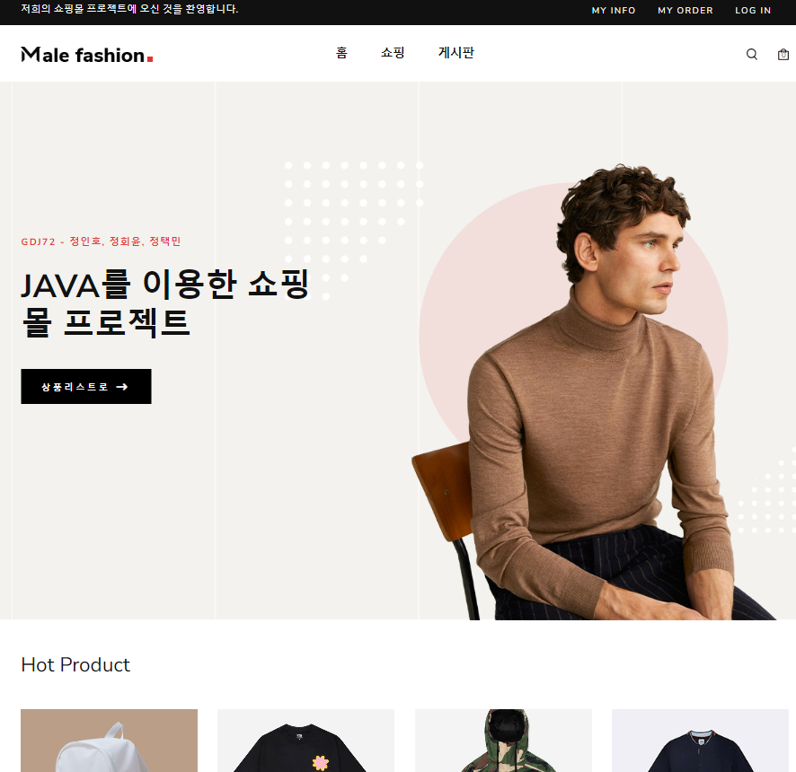
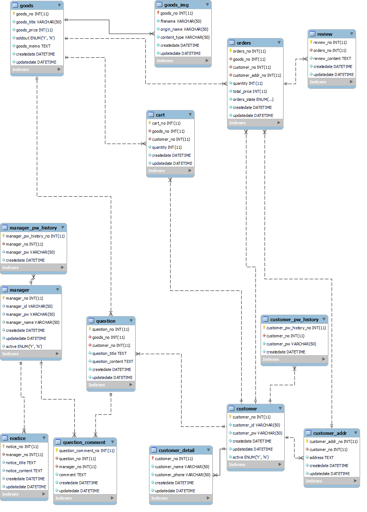

# mall 
### java WEB 프로젝트 구디아카데미 GDJ72기 정인호,정회윤,정택민 참여 쇼핑몰 프로젝트 (2023-10-31 ~ 2023-11-17)
### Eclipse IDE 22.12.0 버전, apache-tomcat-9.0.80 버전 사용 데이터베이스 MariaDB 이용 

Model 1 Architecture  
Java-17, JSP, JavaScript, j-query, bootstrap-5, HTML, CSS, Git, Git-hub

### Role & Responsibility

- 개발자 정회윤 : MANAGER 도메인 담당
  - 상품 CRUD
  - 공지 CRUD 및 게시판 
  - 질문, 답변 CRUD 및 게시판
  - 매니저권한 세션을 활용한 접근제어
- 개발자 정택민 : Goods 도메인 담당
  - 상품관련 productList.jsp에서 템플릿에 맞게 상품사진,정보를 제대로 출력하는데 중점을두어 개발을 진행했습니다. 
- 개발자 정인호 : CUSTOMER 도메인 담당
  - 고객관련 CRUD + SPA에 초점을 둔 화면개발을 했습니다.(customerInfo.jsp)
  - Controller의 기능의 응집도를 높이려 시도했습니다.(customerApiController, orderApiController.jsp)
  - 비동기 post request를 활용하여 View와 Application의 결합도를 낮추기 위해 노력했습니다.
  - 고객권한 세션필터를 활용한 접근제어를 했습니다.
  - 입력폼의 유효성 검사 + 카카오 주소찾기 API 적용했습니다.

